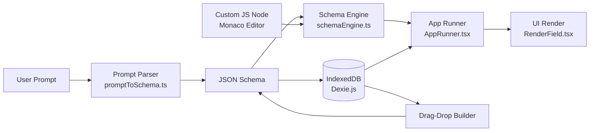

# MicroApp Studio — Design Token Spec

## Architecture Overview



## Component Tree

```
RootLayout (layout.tsx)
├── Dashboard (page.tsx)
│   ├── AppCard[]
│   │   ├── Badge (field types)
│   │   └── Button (run/edit/delete)
│   └── Dialog (create new)
│
├── Builder (builder/page.tsx)
│   ├── Toolbar
│   │   ├── App name (editable)
│   │   ├── Save Button
│   │   └── Preview Button
│   ├── ComponentPalette
│   │   ├── DraggableField[]
│   │   │   └── Icon + Label
│   │   └── CustomNodeButton
│   ├── Canvas (DnD zone)
│   │   ├── SortableField[]
│   │   │   └── FieldCard
│   │   └── EmptyState
│   └── PropertiesPanel
│       ├── FieldType Select
│       ├── Label Input
│       ├── Validation Rules
│       └── Delete Button
│
├── Runner (run/[id]/page.tsx)
│   └── AppRunner
│       ├── RenderField[]
│       │   └── Input (by type)
│       └── OutputPanel
│
└── Dev Playground (dev/page.tsx)
    ├── MonacoEditor
    └── TestOutput
```

## Data Flow

### Create App Flow
```
Prompt Text → parsePrompt() → ParsedSchema
                                     ↓
Card Dialog → AppSchema (JSON) → IndexedDB
                                     ↓
                              Builder Canvas
```

### Run App Flow
```
Select App → Load from IndexedDB → AppSchema
                                         ↓
User Input → executeSchema(schema, values) → EngineResult
                                                    ↓
                                            Render Output
```

### Custom Node Flow
```
Write Code in Monaco → evaluateNode(node, inputs) → Result
                              ↓
                    Save as LogicNode → IndexedDB
```

## Styling Architecture

| Token | Light | Dark |
|-------|-------|------|
| `--background` | `#ffffff` | `#09090b` |
| `--foreground` | `#0a0a0a` | `#fafafa` |
| `--primary` | `#18181b` | `#fafafa` |
| `--primary-foreground` | `#fafafa` | `#18181b` |
| `--secondary` | `#f4f4f5` | `#27272a` |
| `--border` | `#e4e4e7` | `#27272a` |
| `--ring` | `#18181b` | `#d4d4d8` |
| `--radius` | `0.5rem` | `0.5rem` |
| `--muted` | `#f4f4f5` | `#27272a` |
| `--destructive` | `#ef4444` | `#7f1d1d` |

## Key Modules

### Engine (`src/engine/`)
- **promptToSchema.ts** — Pattern-matching NLP parser. Recognizes calculator, form, todo, survey, budget, counter, validator patterns.
- **schemaEngine.ts** — Validates fields, executes custom nodes, returns computed results.
- **evaluator.ts** — Sandboxed Function() executor for custom JavaScript logic nodes.

### Storage (`src/db/`)
- **db.ts** — Dexie.js IndexedDB wrapper. Schema: `apps` table.
- **microAppRepo.ts** — CRUD abstraction layer with getAll, getById, create, update, remove.

### State (`src/store/`)
- **appStore.ts** — Zustand store. Manages app list, active app, field selection, builder state.

### UI (`src/components/`)
- **ui/** — Shadcn-style primitives: Button, Card, Dialog, Tabs, Select, Badge, Input
- **dashboard/** — Gallery + AppCard
- **builder/** — Canvas (dnd-kit), ComponentPalette, PropertiesPanel, Toolbar
- **runner/** — AppRunner, RenderField (9 field types)
- **dev/** — MonacoEditor
